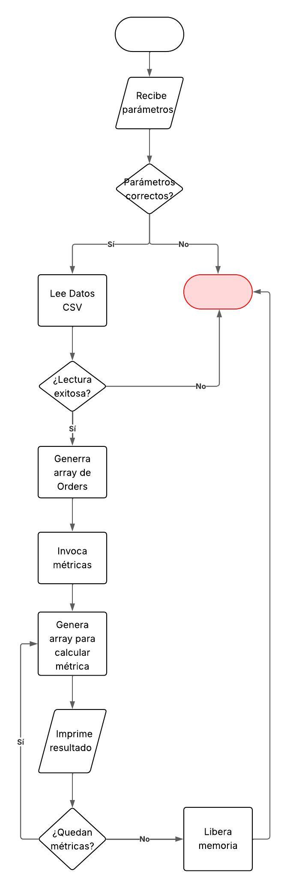

# Introducción

La presenta aplicación permite conocer distintas métricas acerca de las ventas de pizza. Recibe un archivo csv que parsea, almacena en la memoria, y ejecuta las operaciones solicitadas por el usuario. Luego imprime en consola cada uno de los resultados.

## Requerimientos:
- C
- gcc v12.2.0
- make v4.3
- csv con la siguiente información sin datos corruptos ni faltantes:
  - pizza_id,order_id,pizza_name_id,quantity,order_date,order_time,unit_price,total_price,pizza_size,pizza_category,pizza_ingredients,pizza_name

## Métricas

- pms: Pizza más vendida
- pls: Pizza menos vendida
- dms: Fecha con más ventas en términos de dinero (junto a la cantidad de dinero recaudado)
- dls: Fecha con menos ventas en términos de dinero (junto a la cantidad de dinero recaudado)
- dmsp: Fecha con más ventas en términos de cantidad de pizzas (junto a la cantidad de pizzas)
- dlsp: Fecha con menos ventas en términos de cantidad de pizzas (junto a la cantidad de pizzas)
- apo: Promedio de pizzas por orden
- apd: Promedio de pizzas por día
- ims: Ingrediente más vendido
- hp: Cantidad de pizzas por categoría vendidas

## Flujo Aplicación



## Diseño y estructura del proyecto

### Diseño

Se decidió dar al proyecto un diseño del tipo MVC, donde main es el controlador y la vista vendría siendo la terminal.

El parseo del csv se hizo de tal forma de almacenar la información en estructuras de datos que faciliten la búsqueda y el cálculo de las métricas solicitadas. Estamos concientes de que esta solución puede no ser la más eficiente en términos de memoria, pero se optó por esta opción para facilitar la implementación de las métricas al generar variables similares a las que se usan en el lenguaje de programación Python (con el cual los desarrolladores de esta app están todos familiarizados)

### Estructura

Para mantener el orden y las responsabilidades definidas para cada función se determinó estructurar el proyecto de la siguiente forma: 

root: contiene archivo main, archivo csv, los makefile, README.md e informe. Viene también con el binario compilado con gcc en Linux.
metrics: contiene las funciones que calculan las métricas solicitadas.
types: contiene los tipos de estructura usados para manejar los datos
utils: contiene funciones de utilidad para manejar los datos

Esto permitió que:
- El código fuese más fácil de entender y mantener.
- Cada integrante pudiese trabajar en una métrica sin preocuparse de afectar a los demás.
- Tener una parte centralizada que instancia las variables, en este caso, main, y que maneje la entrada y salida de datos.

#### Arbol del proyecto
```
└── 📁App1
    └── 📁metrics
        └── 📁apd
            └── apd.c
            └── apd.h
        └── 📁dls
            └── dls.c
            └── dls.h
        └── 📁dms
            └── dms.c
            └── dms.h
        └── 📁hp
            └── hp.c
            └── hp.h
        └── 📁pls
            └── pls.c
            └── pls.h
        └── 📁pms
            └── pms.c
            └── pms.h
    └── 📁types
        └── dates.h
        └── orders.h
        └── sales.h
    └── 📁utils
        └── csv_convert.c
        └── csv_convert.h
        └── get_sales_by_pizza.c
        └── get_sales_by_pizza.h
        └── get_unique_dates_data.c
        └── get_unique_dates_data.h
    └── .gitignore
    └── app1
    └── diagrama_flujo.jpg
    └── informe.md
    └── main.c
    └── makefile-L
    └── makefile-W
    └── README.md
    └── README2.md
    └── ventas_large.csv
    └── ventas.csv
```

# Instalación y consumo app

## Clonar el repositorio

Si tienes git instalado entonces en la terminal puedes clonar el repositorio con el siguiente comando:
```
git clone https://github.com/alburquenqueletelier/App1
```

## Compilación

Para compilar necesita tener instalado lenguaje ```c```, ```gcc``` v5.1 o superior y ```make```

En linux ejecutar:
```
#bash
make -f makefile-L
```

En windows ejecutar:
```
#bash
make -f makefile-W
```

**Nota: No tiene soporte en mac. Podría no funcionar o subrir errores.**

## Ejecución

En consola ejecutar:
```
#bash
./app1 <data.csv> <metric1> <metric2> ... <metric10>
```
```
#bash
./app1 ventas.csv dms pls # otras métricas
```

**Importante:**
- El archivo csv es el primero que debe agregar en la llamda de la aplicación.
- Puede agregar tantas métricas como las que están soportadas.
- Las métricas son case sensitive, pueden ser ingresadas en cualquier orden y deben estar separadas por un espacio.

## Resumen

| Metrica | Descripción                                              | Respuesta                                                                   |
| ------- | -------------------------------------------------------- | --------------------------------------------------------------------------- |
| pms     | Pizza más vendida en unidades                            | Pizza más vendida: <Nombre Pizza>, Cantidad: <Cantidad>                     |
| pls     | Pizza más vendida en unidades                            | Pizza menos vendida: <Nombre Pizza>, Cantidad: <Cantidad>                   |
| dms     | Fecha con más ventas en términos de dinero               | Fecha con más ventas: <dd-mm-aaaa>, Ganancia: $<Ganancia>                   |
| dls     | Fecha con menos ventas en términos de dinero             | Fecha con menos ventas: <dd-mm-aaaa>, Ganancia: $<Ganancia>                 |
| dmsp    | Fecha con más ventas en términos de cantidad de pizzas   | Fecha con más ventas: <dd-mm-aaaa>, Ganancia: $<Ganancia>                   |
| dlsp    | Fecha con menos ventas en términos de cantidad de pizzas | Fecha con menos ventas: <dd-mm-aaaa>, Ganancia: $<Ganancia>                 |
| apo     | Promedio de pizzas por orden                             | Promedio de pizzas vendidas por orden: <Promedio>                           |
| apd     | Promedio de pizzas por día                               | Promedio de pizzas vendidas por día: <Promedio>                             |
| ims     | Ingrediente más vendido                                  | Ingrediente más vendido: <Ingrediente>                                      |
| hp      | Cantidad de pizzas por categoría vendidas                | <Nombre Pizza> venvidas: <Cantidad>, \n <Nombre Pizza> vendidas: <Cantidad> |

## Limpieza

Si desea borrar el binario de la aplicación y archivos .o , ejecutar:
En Linux
```
make -f makefile-L clean
```

En Windows
```
make -f makefile-W clean
```
# Reflexiones y Autoevaluación

#### Bryan Alburquenque

1. ¿Qué fue lo más complejo o interesante de la tarea?
Personalmente fue mantener una complejidad espacial para no ser ineficiente en el uso de la memoria. Teniamos la idea de optimizar recursos desde el principio, no obstante, no se justificaba en todos los casos en cuanto a que incrementa considerablemente la dificultad del desarrollo y que además existen campos del csv cuyo valor máximo es conocido de antemano como el caso de la fecha. 

2. ¿Cómo enfrentaron los errores, pruebas y debugging?
Casi no tuve errores de sintaxis gracias al pluggin de C en vs code. La mayor cantidad de incidentes y warnings surgían a la hora de compilar o de lleno en la ejecución del código. Esto nos hizo definir un flujo de trabajo que consiste en que cada developer desarrolla su función, compila, prueba que funcionen todas las métricas existentes y si tiene éxito entonces recién ahí puede hacer un push. En cuanto a la compilación se hizo grata gracias a las flags -wall y -g que permitían principalmente conocer variables sin uso, warnings de tipos, entre otros. 

3. ¿Qué lecciones aprendieron al implementar en C este tipo de lectura de archivos y cálculos de métricas?
Que la lectura de archivos en C, si bien tiene una complejidad mayor a lenguajes de más alto nivel, dada su naturaleza permite abordar el problema de distintas formas, al permitir recorrer los datos con un buffer, usar una cadena de string con strtok, o parsear los datos y almacenarlos en una estructura como fue nuestra elección.
En cuanto al cálculo de las métricas nos permitió entender como se pueden abordar problemas complejos de manera que se puedan dividir en problemas más pequeños. En este caso, creamos variables con información necesaria para poder encontrar lo que la métrica necesita. Por ejemplo, para encontrar la pizza más vendida, necesitamos saber la cantidad de pizzas vendidas por cada tipo de pizza. Esto transforma el problema a una función de búsqueda con criterio de maximización. 

### Joaquín
1. ¿Qué fue lo más complejo o interesante de la tarea?
2. ¿Cómo enfrentaron los errores, pruebas y debugging?
3. ¿Qué lecciones aprendieron al implementar en C este tipo de lectura de archivos y cálculos de métricas?
### Eduardo
1. ¿Qué fue lo más complejo o interesante de la tarea?
2. ¿Cómo enfrentaron los errores, pruebas y debugging?
3. ¿Qué lecciones aprendieron al implementar en C este tipo de lectura de archivos y cálculos de métricas?
### Benjamín
1. ¿Qué fue lo más complejo o interesante de la tarea?
2. ¿Cómo enfrentaron los errores, pruebas y debugging?
3. ¿Qué lecciones aprendieron al implementar en C este tipo de lectura de archivos y cálculos de métricas?


# Referencias

- [ChatGPT](https://chatgpt.com/) Para debuggear, aprender a construir makefile, aprender a usar puntero a puntero.
- [Draw Folder Structure](https://marketplace.visualstudio.com/items?itemName=jmkrivocapich.drawfolderstructure) Para generar archivo con la estructura del proyecto.
- [DeepSeek](https://www.deepseek.com/) Para generar fake data con el objetivo de testear la app.
- [Learn Microsoft](https://learn.microsoft.com/) Para aprender sobre funciones en librerías stdio y string.
- [Markdown](https://markdown.es) Para aprender sintaxis markdown.
- [StackEdit](https://stackedit.io) Para visualizar sintaxis markdown.